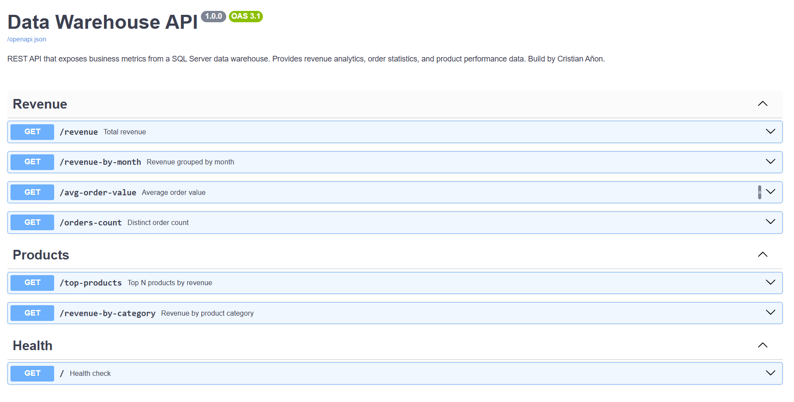
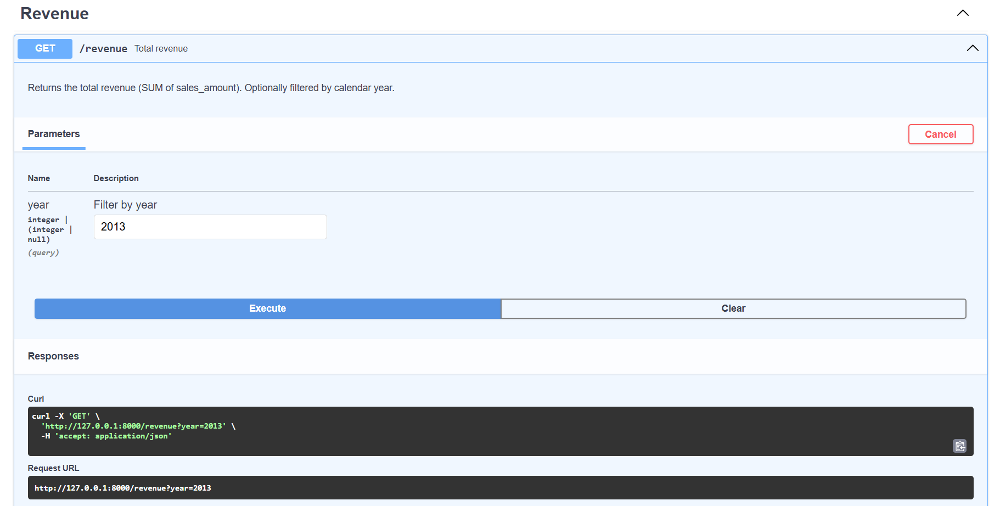
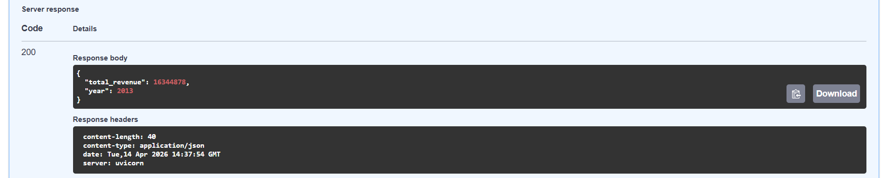
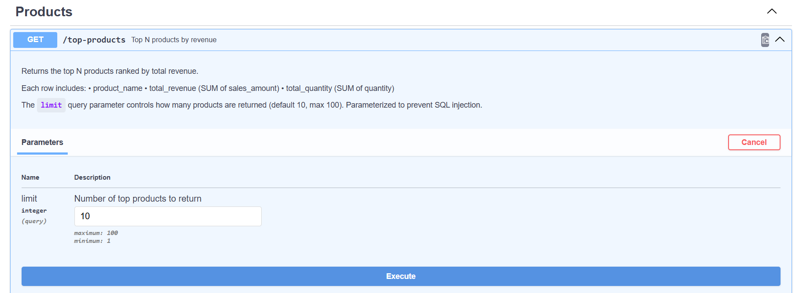
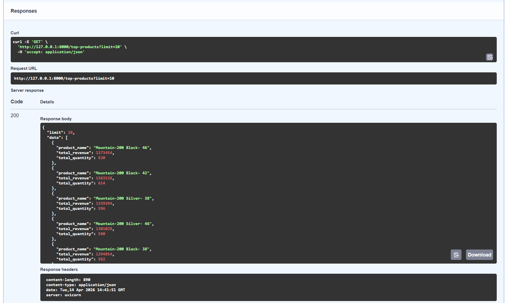

# Data Warehouse Backend API

REST API built with **FastAPI** that connects to a **Microsoft SQL Server** data warehouse and exposes business metrics through clean, documented endpoints.
This API consumes data from the data warehouse defined in my other project:
[SQL Data Warehouse](https://github.com/cea123s/sql-data-warehouse)

## Tech Stack

| Component         | Technology                    |
|-------------------|-------------------------------|
| Language          | Python 3.10+                  |
| Framework         | FastAPI                       |
| Database          | Microsoft SQL Server          |
| DB Driver         | pyodbc (ODBC Driver 17)       |
| Env Management    | python-dotenv                 |

## Project Structure

```
backend-api/
├── app/
│   ├── __init__.py
│   ├── main.py          # Application entry point & health check
│   ├── database.py      # SQL Server connection layer
│   └── routes/
│       ├── __init__.py
│       ├── revenue.py   # Revenue & order endpoints
│       └── products.py  # Product & category endpoints
├── .env.example         # Template for environment variables
├── .gitignore
├── requirements.txt
└── README.md
```

## Setup

### 1. Prerequisites

- **Python 3.10+** installed
- **ODBC Driver 17 for SQL Server (pyodbc)** installed ([Download here](https://learn.microsoft.com/en-us/sql/connect/odbc/download-odbc-driver-for-sql-server))
- **FastAPI** installed
- **python-dotenv** installed
- **uvicorn** installed (optional for testing)
- Access to a SQL Server instance with the data warehouse schema as defined in my other project: [SQL Data Warehouse](https://github.com/cea123s/sql-data-warehouse)

### 2. Create a virtual environment

```bash
python -m venv venv

# Windows
venv\Scripts\activate

# macOS / Linux
source venv/bin/activate
```

### 3. Install dependencies

```bash
pip install -r requirements.txt
```

### 4. Configure environment variables

Copy the example file and fill in your credentials:

```bash
cp .env.example .env
```

Edit `.env` with your SQL Server connection details:

```env
DB_SERVER=your_server_name_or_ip
DB_NAME=your_database_name
DB_USER=your_username
DB_PASSWORD=your_password
```

### 5. Run the application

```bash
uvicorn app.main:app --reload
```

The API will be available at **http://127.0.0.1:8000**.

## API Documentation

Interactive documentation is auto-generated by FastAPI:

| Format     | URL                              |
|------------|----------------------------------|
| Swagger UI | http://127.0.0.1:8000/docs       |
| ReDoc      | http://127.0.0.1:8000/redoc      |



## API Endpoints

### Health

| Method | Path | Description          |
|--------|------|----------------------|
| GET    | `/`  | Health check         |

### Revenue

| Method | Path               | Description                                | Parameters              |
|--------|--------------------|--------------------------------------------|-------------------------|
| GET    | `/revenue`         | Total revenue (SUM of sales_amount)        | `year` (optional, int)  |
| GET    | `/revenue-by-month`| Revenue grouped by year and month          | —                       |
| GET    | `/avg-order-value` | Average order value                        | —                       |
| GET    | `/orders-count`    | Count of distinct orders                   | —                       |

### Example:




### Products

| Method | Path                  | Description                        | Parameters                    |
|--------|-----------------------|------------------------------------|-------------------------------|
| GET    | `/top-products`       | Top N products by revenue          | `limit` (optional, default 10)|
| GET    | `/revenue-by-category`| Revenue breakdown by category      | —                             |

### Example:




## Database Schema

The API queries two tables in the data warehouse as defined in my other project: [SQL Data Warehouse](https://github.com/cea123s/sql-data-warehouse):

### `gold.fact_sales`

| Column         | Description              |
|----------------|--------------------------|
| order_number   | Unique order identifier  |
| product_key    | FK to dim_product        |
| customer_key   | Customer identifier      |
| order_date     | Date the order was placed|
| shipping_date  | Date the order shipped   |
| due_date       | Payment due date         |
| sales_amount   | Revenue for the line     |
| quantity       | Units sold               |
| price          | Unit price               |

### `gold.dim_product`

| Column         | Description              |
|----------------|--------------------------|
| product_key    | PK / surrogate key       |
| product_id     | Business product ID      |
| product_number | Product SKU              |
| product_name   | Display name             |
| category_id    | Category identifier      |
| category       | Category name            |
| subcategory    | Subcategory name         |
| maintenance    | Maintenance flag         |
| cost           | Product cost             |
| product_line   | Product line             |
| start_date     | Record effective date    |

## Security

- Credentials are **never hardcoded** — always loaded from environment variables.
- `.env` is excluded from version control via `.gitignore`.
- Environment variables are **validated at startup**; the app will fail fast with a clear error if any are missing.
- **Parameterized queries** are used wherever user input reaches SQL to prevent injection.

## License

This project is under the [MIT License](https://opensource.org/license/mit).  

## About Me
My name is Cristian Añon. I have a degree in Electronic Arts specializing in data. I combine technical rigor with design, creativity, and communication.

[](https://linkedin.com/in/ceanon)

## Español
API REST desarrollada con **FastAPI** que se conecta a un Data Warehouse de **Microsoft SQL Server** y expone métricas de negocio a través de puntos de acceso documentados y bien definidos.
Esta API consume datos del Data Warehouse definido en mi otro proyecto: [SQL Data Warehouse](https://github.com/cea123s/sql-data-warehouse)
